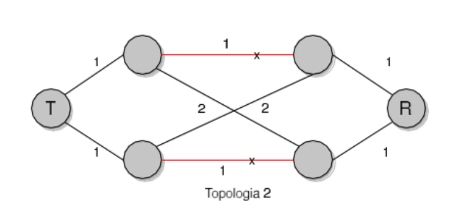

Get into the ns-3.30 folder. The simulations need to be copied inside the `scratch` folder.

To constantly build and run the simulation:
```sh
watch -n 15 './waf --run line-simulation'
```

## Topology 2



```sh
   A  ---  B
  /  \2  /  \
T             R
  \  /2  \  /
   C  ---  D
```

### RIP

A partir de 33s o protocolo RIP determina as rotas e a transmissão funciona. Os pacotes então
começam a ser transmitidos.

A rota escolhida abrange os nós `T-C-D-R`. Onde o nó T é o cliente da requisição é o nó R o servidor.

O protocólo RIP neste caso precisa de duas execuções (por padrão a cada 30s o protocólo envia atualização de rotas).

Após 55 segundo as conexões entre `A-B` e `C-D` caem. E uma nova rota precisa ser determinada.
A conexão cai e após 9s a nova rota escolhida é `T-A-D-R` e a comunicação volta a acontecer.

Após 55 segundos da queda a conexão entre `A-B` e `C-D` é restabelecida. Nada acontece com a comunicação vigente.

Após o protocólo atualizar as rotas a conexão volta a ocorrer pelo mesmo caminho inicial: `T-C-D-R`.

## Topologia 3

### RIP

A partir de 32s as rotas estão determinadas e a transmissão é iniciada porém o servidor ainda não
tem a rota do cliente determinada. Após 38s o RIP determinou a rota do servidor para o cliente e
o servidor então consegue responder ao cliente.

A rota utilizada para envio dos pacotes é `T-A-B-C-R`. A rota utilizada para responder ao cliente
é `R-D-E-A-T`.


